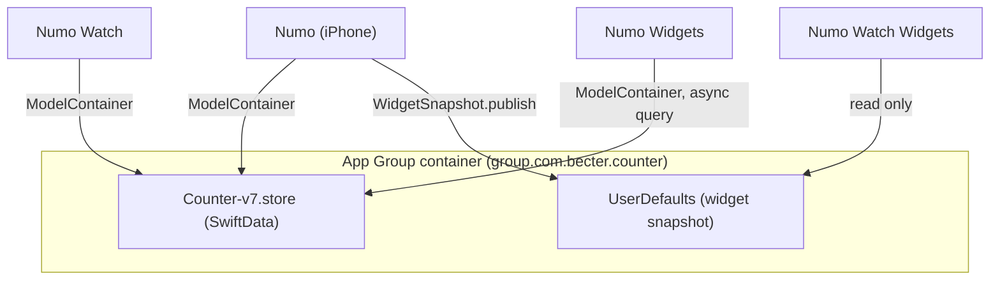
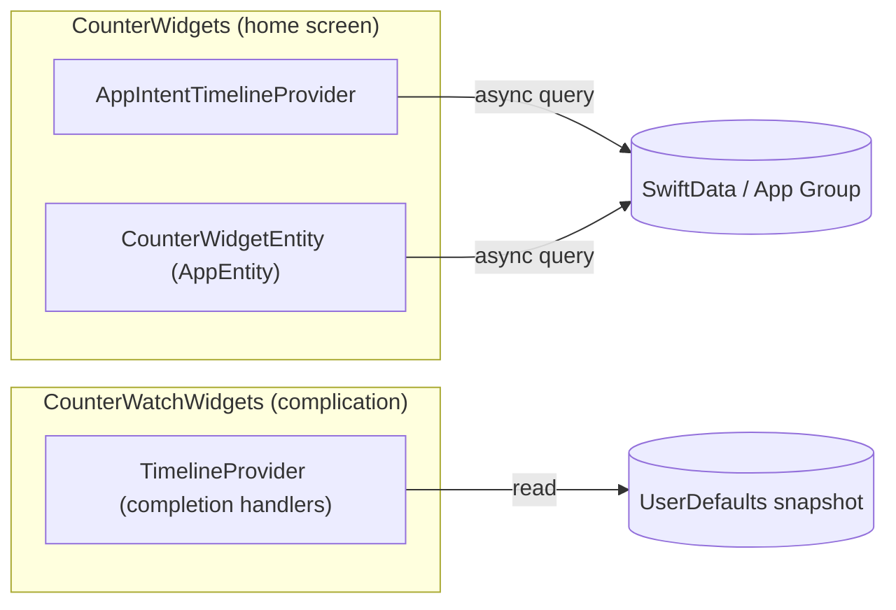

# Architecture

Numo is a SwiftUI + SwiftData app for logging counters (calories, custom metrics)
against a repeating goal period, with a watchOS companion and home-screen/watch-face
widgets. Xcode targets and bundle IDs still use the historical `Counter` name; the
product display name is Numo. This document describes how the pieces fit together and why.

## Module map

```
Counter/             iOS app target
  Design/            Design system: tokens → semantic colors → components
  Views/              Screens, grouped by feature area
  Services/          (currently empty — see "Where business logic lives" below)
CounterWatch/         watchOS companion app target
CounterWidgets/       Home screen widgets (WidgetKit + App Intents)
CounterWatchWidgets/  Watch face complication (WidgetKit)
Shared/                Models, SwiftData container, and domain logic —
                       compiled directly into every target that needs it
CounterTests/          Unit tests (Swift Testing) for Shared/ domain logic
```

`Shared/` is not a separate framework or Swift package — its files are added directly to
each target's compile sources (visible in `project.pbxproj`, where e.g. `EntryActions.swift`
appears in the `Counter`, `CounterWatch`, and `CounterWidgets` source lists). This keeps the
build simple (no module boundaries, no `@testable import` needed) at the cost of having to
remember to add new Shared files to every target that needs them. `CounterWatchWidgets` only
needs a small slice of `Shared/` (`AppGroup`, `WidgetSnapshot`) since it reads pre-published
snapshot data rather than querying SwiftData directly — see "Two widget data paths" below.

## Data flow: SwiftData + App Group



- `Shared/SharedModelContainer.swift` builds one `ModelContainer` backed by a file in the
  App Group container (`AppGroup.identifier`), falling back to the app's Documents
  directory if the group URL can't be resolved (e.g. entitlements misconfigured locally).
- iPhone, Watch, and the home-screen widget extension all open that same container and can
  read/write `CustomCounter` / `CounterEntry` directly — SwiftData handles cross-process
  consistency. Store file: `AppGroup.storeFilename` (`Counter-v7.store`).
- The watch *complication* (`CounterWatchWidgets`) does **not** query SwiftData. It reads a
  small `title` / `heroValue` snapshot from shared `UserDefaults`
  (`Shared/WidgetSnapshot.swift`), published by the iPhone app (`WidgetSnapshotSync`)
  whenever a counter's total changes. This is a deliberate simplification for a
  low-complexity complication (see [DECISIONS.md](DECISIONS.md)).
- In-memory (Xcode previews/tests) and persistent stores are both driven by the same
  `Schema`; tests build their own isolated in-memory container
  (`CounterTests/TestModelContainer.swift`) rather than touching the App Group store.

## State management

There is no MVVM layer and no `ObservableObject` view-model layer. Views own UI state
directly. A few small `@Observable` helpers exist for performance or presentation plumbing
(e.g. `RevealState` so per-frame reveal offsets don't rebuild the whole pager tree;
`FPSMonitor` for the debug HUD) — these are not screen view models.

- `@Query` drives lists directly from SwiftData (`AllCountersListView`, `CounterPagerView`,
  `WatchCounterListView`, …) — SwiftData notifies SwiftUI on changes, so this is already
  reactive without an intermediate view model.
- `@Bindable` is used where a view edits a `@Model` instance in place
  (`CustomCounterPageContent`, `TodayLogView`, `WatchCounterDetailView`).
- `@State` holds transient UI-only state (sheet presentation flags, drag gesture state,
  form field text) that has no reason to outlive the view.
- Mutations and domain calculations go through small, static, stateless enums in
  `Shared/` rather than instance methods on a view model — see below.

## Where business logic lives

Rather than a `Services/` layer of injectable protocols, the app uses static enums as
namespaced pure/near-pure functions:

| Enum | Responsibility |
|---|---|
| `CounterPeriodCalculator` (`Shared/CounterPeriod.swift`) | Reset-period math: current range for daily/weekly/monthly/yearly, period totals, reset-summary strings |
| `GoalProgressCalculator` (`Shared/GoalDirection.swift`) | Builds a `GoalProgress` value (fractions, hero strings, stat rows) for a counter's current total vs. its goal |
| `HistoryAggregator` (`Shared/HistoryAggregator.swift`) | Buckets entries into `DailyValue`s for the history chart across day/week/month windows |
| `EntryActions` (`Shared/EntryActions.swift`) | Stateless insert/update/delete of a `CounterEntry` |
| `QuickAddSessionStore` (`Shared/QuickAddSessionStore.swift`) | The 2-second quick-add batching window. A real (non-static) type rather than another enum — see "Quick-add batching state" below |
| `QuickAddConfiguration` (`Shared/QuickAddConfiguration.swift`) | Default/normalized quick-add preset button values, which built-in preset set a counter defaults to by name, and applying a single preset-field edit |
| `AmountInput` (`Shared/AmountInput.swift`) | Text-field sanitization/parsing rules for numeric input — amount entry, quick-add preset editing, goal fields, entry-log editing, the numeric keypad |
| `CounterFormValidation` (`Shared/CounterFormValidation.swift`) | The create/edit form save-gating rule (name required if present, goal text optional but must parse if non-empty) |
| `HistoryChartScale` (`Shared/HistoryChartScale.swift`) | Y-axis "nice maximum" and tick-value math for the history bar chart |
| `CustomCounter.currentTotal/currentProgress/currentRingDisplay` (`Shared/CustomCounter+Progress.swift`) | Convenience combinators tying the above together for "this counter's current period" — used by the pager, list, widgets, and watch so they can't quietly diverge |

Views call into these directly. This keeps the object graph flat (a view either owns UI
state or reads/writes SwiftData through a one-line static call) and keeps the domain logic
unit-testable without instantiating any SwiftUI view — see [TESTING.md](TESTING.md).

A second pass pulled logic that was still embedded *inside* views out into `Shared/` once it
turned out to be genuinely duplicated or silently diverging rather than view-specific:

- `CounterResetPeriod.defaultAnchorDay(calendar:)` / `.normalizedAnchorDay(_:calendar:)` — the
  create and edit forms each had their own hand-rolled "what anchor day should this period
  start from" logic, and they disagreed: create always overwrote the anchor on period change,
  edit only corrected it when it was out of range. Both now call the same
  `normalizedAnchorDay`, which is the more correct of the two behaviors (it doesn't discard an
  already-valid anchor the user picked just because they clicked through another period first).
- `GoalProgress.compactHeroValue` (`Shared/GoalDirection.swift`) — the Watch detail view
  formatted its hero number differently from every other surface (`"70/150"` instead of just
  `"70"`) because it has no room for a second caption line the way the iPhone pager/list do.
  That was inline `switch` logic in the view; it's now a named, tested property on
  `GoalProgress` so the difference is documented rather than looking like an oversight.
- `CounterPeriodCalculator.currentEntries(for:)` — "this counter's current-period entries,
  newest first" was reimplemented at two call sites (`CustomCounterPageContent`,
  `TodayLogView`); a new call site could easily have picked a different sort order by accident.
- `QuickAddConfiguration.defaultPresets(forCounterNamed:)` — only the settings sheet used to
  special-case "Calories" when picking default quick-add presets; the main page, widget, and
  Watch grid all fell back to the generic preset set for a Calories counter. Centralizing the
  name check fixed that divergence rather than just documenting it.
- `QuickAddConfiguration.replacingPreset(_:with:in:)` — the settings preset grid's "replace or
  append, then re-normalize" edit rule now lives next to the other preset rules instead of as a
  private method on the view.
- `CustomCounter.nextPaletteIndex(forExistingCount:)` — a thin, named wrapper around
  `normalizedPaletteIndex` for its one call site (assigning a new counter's initial palette
  slot), so that call site doesn't need to know palette-index wrapping is happening at all.

The Watch quick-add grid also switched from `QuickAddConfiguration.normalizedPresets` (only
ever shows what's stored) to `filledPresets` (pads out to a full grid from the defaults), to
match the iPhone grid's fill policy — the two used to show different numbers of buttons for the
same counter.

### Quick-add batching state

Rapid taps on the same quick-add button accumulate into one `CounterEntry` instead of
inserting a row per tap, if they land within `QuickAddSessionStore.batchInterval` (2s) of
each other. That batching window is mutable, in-memory state (which entry is currently being
accumulated into, and when it was last touched) — unlike everything else in the table above,
which is pure/stateless. It intentionally isn't another `private static var` hidden inside a
stateless-looking enum (that was the original design, and it made the batching window a
hidden global with no visible owner or lifetime). Instead it's a small `@MainActor final
class` that call sites hold explicitly:

- `CustomCounterPageContent` and `WatchCounterDetailView` each keep one in `@State`, scoped
  to that counter page's lifetime.
- The widget extension's `AddCounterEntryIntent` (via `WidgetCounterLoader`) has no view to
  own this state, so it explicitly opts into `QuickAddSessionStore.shared` — the one
  legitimate singleton here, now visible and named instead of smuggled into `EntryActions`.

## Schema

There is no `VersionedSchema` / migration plan. The live schema is
`Schema([CustomCounter.self, CounterEntry.self])` in `SharedModelContainer`. Amounts are
stored as `Double` (rounded to two decimal places via `CounterAmount.rounded`). Schema
breaks bump `AppGroup.storeFilename` (currently `Counter-v7.store`) for a clean store; if
open still fails, `SharedModelContainer` deletes the store files and recreates an empty
container.

## Design system

```
Design/
  Tokens/      BaseColorTokens, SemanticColorTokens, TypographyTokens, LayoutTokens,
               CounterPaletteTokens (10-slot counter color palette)
  Theme/       CounterPalette / CounterAccent (per-counter accent resolution),
               CounterAppearance (light/dark)
  System/      DesignSystemEnvironment — `@Entry`-backed environment values for colors/accent/pager state
  Modifiers/   Text style, glass surface, sheet presentation modifiers
  Components/  Buttons, cards, charts, lists, keypad, toast, settings controls, etc.
  Resources/   tokens.json — documents the token values; Swift is the canonical source
```

Colors are two-tier: `BaseColor` (raw values) → `SemanticColors` (light/dark-aware,
purpose-named: `textPrimary`, `surfaceSheet`, …), injected via
`.counterDesignSystemFromColorScheme()` / `.counterDesignSystemFromAppearancePreference()`
and read with `@Environment(\.semanticColors)`. Layout uses an 8pt grid
(`GridToken`/`SpaceToken`), and typography is expressed as named `TypeStyle`s applied via
`.counterTextStyle(_:)`. The 10-slot counter palette (`CounterPaletteTokens`) and the
progress ring geometry (`ProgressRingArc`) are shared with the widget extension via
`Shared/CounterPaletteData.swift` and `Shared/ProgressRingArc.swift` respectively, so the
app and widget can't visually drift apart (see [DECISIONS.md](DECISIONS.md)).

## Two widget data paths



- **Home screen widgets** (`CounterWidgets`) are configurable per counter via App Intents
  (`CounterWidgetConfigurationIntent`, `CounterWidgetEntity`), query SwiftData directly and
  asynchronously (`WidgetCounterLoader`), and support interactive quick-add buttons via
  `AddCounterEntryIntent`.
- **The watch complication** (`CounterWatchWidgets`) shows only the default counter's title
  and hero value, sourced from the `UserDefaults` snapshot rather than SwiftData. It uses
  WidgetKit's completion-handler `TimelineProvider` rather than `AppIntentTimelineProvider`
  because it isn't user-configurable — there's no meaningful async work to do that would
  benefit from `async`/`await` here (see [DECISIONS.md](DECISIONS.md) for why this wasn't
  "modernized" to match the home widget's provider style).

## Concurrency model

The project builds with Swift 6 strict concurrency (`SWIFT_STRICT_CONCURRENCY = complete`)
and a module-wide default actor isolation of `MainActor`
(`SWIFT_DEFAULT_ACTOR_ISOLATION = MainActor`). In practice this means:

- Most code (views, `EntryActions`, `WidgetCounterLoader` mutators, seeders) is implicitly
  `@MainActor` and doesn't need explicit annotations.
- Pure calculators with no `ModelContext`/UI dependency — `CounterPeriodCalculator`,
  `GoalProgressCalculator`, `HistoryAggregator`, `QuickAddConfiguration`, `AmountInput`,
  `CounterFormValidation`, `HistoryChartScale`, `AppLog`, and the plain
  value types they operate on (`CounterResetPeriod`, `GoalDirection`, `DailyValue`,
  `HistoryPeriod`, …) — are explicitly `nonisolated`. They do real work off the main actor in
  tests and don't need the main-actor hop the module default would otherwise force on them.
- `@Model` types (`CustomCounter`, `CounterEntry`, …) opt out of the module's default
  `MainActor` isolation — unlike plain enums/structs, which inherit it. Code that reads a
  model's stored properties (e.g. `CustomCounter+Progress.swift`, which reads `self.entries`)
  has to be *explicitly* `@MainActor`, even though the pure math it delegates to
  (`CounterPeriodCalculator`, `GoalProgressCalculator`) is `nonisolated` — see that file's doc
  comment for the exact reasoning, since this is the easiest of these rules to get backwards.
- `async`/`await` is used at real asynchronous boundaries: widget timeline/entity queries,
  App Intent `perform()`, and the entry-added toast's auto-dismiss (`Task.sleep`).
- There are no Combine publishers and no custom `actor` types — the app is small enough
  that `@MainActor`-isolated static functions are sufficient; SwiftData/SwiftUI provide the
  reactivity that would otherwise need Combine. `QuickAddSessionStore` is the one hand-rolled
  stateful class, and it's `@MainActor` rather than an `actor`, since it's only ever touched
  from main-actor call sites and an `actor` would just add `await` at every call site for no
  isolation benefit.
- The two `DispatchQueue.main.asyncAfter` timed delays in `CounterUnderlayReveal` (scroll
  lock/unlock around the reveal animation) were converted to
  `Task { @MainActor in try? await Task.sleep(...) }` for consistency with the rest of the
  codebase. `CounterSheetPresentationModifier`'s `DispatchQueue.main.async` was **not**
  converted — it defers a UIKit sheet-detent mutation out of `updateUIView`, which is an
  idiomatic GCD hop tied to the UIKit update cycle, not a timed delay.
