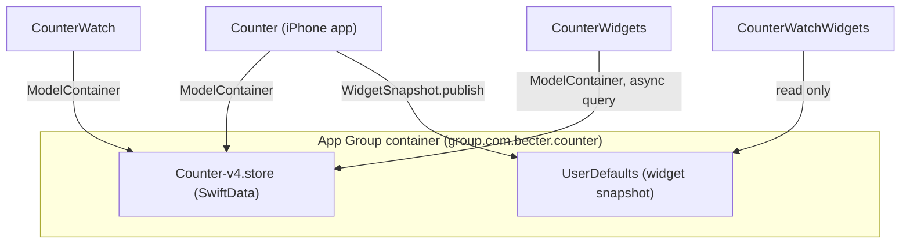
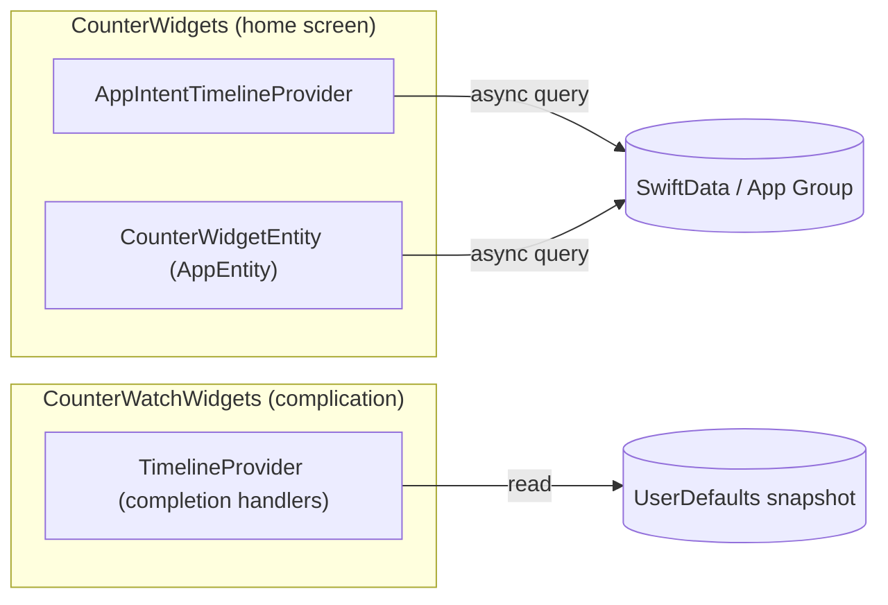

# Architecture

Counter is a SwiftUI + SwiftData app for logging counters (calories, custom metrics)
against a repeating goal period, with a watchOS companion and home-screen/watch-face
widgets. This document describes how the pieces fit together and why.

## Module map

```
Counter/             iOS app target
  Design/            Design system: tokens → semantic colors → components
  Views/              Screens, grouped by feature area
  Services/          (currently empty — see "Where business logic lives" below)
CounterWatch/         watchOS companion app target
CounterWidgets/       Home screen widgets (WidgetKit + App Intents)
CounterWatchWidgets/  Watch face complication (WidgetKit)
Shared/                Models, SwiftData container, and domain logic —
                       compiled directly into every target that needs it
CounterTests/          Unit tests (Swift Testing) for Shared/ domain logic
```

`Shared/` is not a separate framework or Swift package — its files are added directly to
each target's compile sources (visible in `project.pbxproj`, where e.g. `EntryActions.swift`
appears in the `Counter`, `CounterWatch`, and `CounterWidgets` source lists). This keeps the
build simple (no module boundaries, no `@testable import` needed) at the cost of having to
remember to add new Shared files to every target that needs them. `CounterWatchWidgets` only
needs a small slice of `Shared/` (`AppGroup`, `WidgetSnapshot`) since it reads pre-published
snapshot data rather than querying SwiftData directly — see "Two widget data paths" below.

## Data flow: SwiftData + App Group



- `Shared/SharedModelContainer.swift` builds one `ModelContainer` backed by a file in the
  App Group container (`AppGroup.identifier`), falling back to the app's Documents
  directory if the group URL can't be resolved (e.g. entitlements misconfigured locally).
- iPhone, Watch, and the home-screen widget extension all open that same container and can
  read/write `CustomCounter` / `CounterEntry` directly — SwiftData handles cross-process
  consistency.
- The watch *complication* (`CounterWatchWidgets`) does **not** query SwiftData. It reads a
  small `title` / `heroValue` snapshot from shared `UserDefaults`
  (`Shared/WidgetSnapshot.swift`), published by the iPhone app (`WidgetSnapshotSync`)
  whenever a counter's total changes. This is a deliberate simplification for a
  low-complexity complication (see [DECISIONS.md](DECISIONS.md)).
- In-memory (Xcode previews/tests) and persistent stores are both driven by the same
  `Schema`; tests build their own isolated in-memory container
  (`CounterTests/TestModelContainer.swift`) rather than touching the App Group store.

## State management

There is no MVVM layer, `ObservableObject`, or `@Observable` view model anywhere in the
app. Views are the state:

- `@Query` drives lists directly from SwiftData (`AllCountersListView`, `CounterPagerView`,
  `WatchCounterListView`, …) — SwiftData notifies SwiftUI on changes, so this is already
  reactive without an intermediate view model.
- `@Bindable` is used where a view edits a `@Model` instance in place
  (`CustomCounterPageContent`, `TodayLogView`, `WatchCounterDetailView`).
- `@State` holds transient UI-only state (sheet presentation flags, drag gesture state,
  form field text) that has no reason to outlive the view.
- Mutations and domain calculations go through small, static, stateless enums in
  `Shared/` rather than instance methods on a view model — see below.

## Where business logic lives

Rather than a `Services/` layer of injectable protocols, the app uses static enums as
namespaced pure/near-pure functions:

| Enum | Responsibility |
|---|---|
| `CounterPeriodCalculator` (`Shared/CounterPeriod.swift`) | Reset-period math: current range for daily/weekly/monthly, period totals, reset-summary strings |
| `GoalProgressCalculator` (`Shared/GoalDirection.swift`) | Builds a `GoalProgress` value (fractions, hero strings, stat rows) for a counter's current total vs. its goal |
| `HistoryAggregator` (`Shared/HistoryAggregator.swift`) | Buckets entries into `DailyValue`s for the history chart across day/week/month windows |
| `EntryActions` (`Shared/EntryActions.swift`) | Insert/update/delete `CounterEntry`, including the 2-second quick-add batching window |
| `QuickAddConfiguration` (`Shared/QuickAddConfiguration.swift`) | Default/normalized quick-add preset button values |
| `CalorieMigration` (`Shared/CalorieMigration.swift`) | One-time migration of the legacy single-counter calorie model into `CustomCounter` |
| `CustomCounter.currentTotal/currentProgress/currentRingDisplay` (`Shared/CustomCounter+Progress.swift`) | Convenience combinators tying the above together for "this counter's current period" — used by the pager, list, widgets, and watch so they can't quietly diverge |

Views call into these directly. This keeps the object graph flat (a view either owns UI
state or reads/writes SwiftData through a one-line static call) and keeps the domain logic
unit-testable without instantiating any SwiftUI view — see [TESTING.md](TESTING.md).

## Design system

```
Design/
  Tokens/      BaseColorTokens, SemanticColorTokens, TypographyTokens, LayoutTokens,
               CounterPaletteTokens (20-slot counter color palette)
  Theme/       CounterPalette / CounterAccent (per-counter accent resolution),
               CounterAppearance (light/dark)
  System/      DesignSystemEnvironment — environment keys for colors/accent/pager state
  Modifiers/   Text style, glass surface, sheet presentation modifiers
  Components/  Buttons, cards, charts, lists, keypad, toast, settings controls, etc.
  Resources/   tokens.json — documents the token values; Swift is the canonical source
```

Colors are two-tier: `BaseColor` (raw values) → `SemanticColors` (light/dark-aware,
purpose-named: `textPrimary`, `surfaceSheet`, …), injected via
`.counterDesignSystemFromColorScheme()` / `.counterDesignSystemFromAppearancePreference()`
and read with `@Environment(\.semanticColors)`. Layout uses an 8pt grid
(`GridToken`/`SpaceToken`), and typography is expressed as named `TypeStyle`s applied via
`.counterTextStyle(_:)`. The 20-slot counter palette (`CounterPaletteTokens`) and the
progress ring geometry (`ProgressRingArc`) are shared with the widget extension via
`Shared/CounterPaletteData.swift` and `Shared/ProgressRingArc.swift` respectively, so the
app and widget can't visually drift apart (see [DECISIONS.md](DECISIONS.md)).

## Two widget data paths



- **Home screen widgets** (`CounterWidgets`) are configurable per counter via App Intents
  (`CounterWidgetConfigurationIntent`, `CounterWidgetEntity`), query SwiftData directly and
  asynchronously (`WidgetCounterLoader`), and support interactive quick-add buttons via
  `AddCounterEntryIntent`.
- **The watch complication** (`CounterWatchWidgets`) shows only the default counter's title
  and hero value, sourced from the `UserDefaults` snapshot rather than SwiftData. It uses
  WidgetKit's completion-handler `TimelineProvider` rather than `AppIntentTimelineProvider`
  because it isn't user-configurable — there's no meaningful async work to do that would
  benefit from `async`/`await` here (see [DECISIONS.md](DECISIONS.md) for why this wasn't
  "modernized" to match the home widget's provider style).

## Concurrency model

The project builds with Swift 6 strict concurrency (`SWIFT_STRICT_CONCURRENCY = complete`)
and a module-wide default actor isolation of `MainActor`
(`SWIFT_DEFAULT_ACTOR_ISOLATION = MainActor`). In practice this means:

- Most code (views, `EntryActions`, `WidgetCounterLoader` mutators, seeders) is implicitly
  `@MainActor` and doesn't need explicit annotations.
- `async`/`await` is used at real asynchronous boundaries: widget timeline/entity queries,
  App Intent `perform()`, and the entry-added toast's auto-dismiss (`Task.sleep`).
- There are no Combine publishers and no custom `actor` types — the app is small enough
  that `@MainActor`-isolated static functions are sufficient; SwiftData/SwiftUI provide the
  reactivity that would otherwise need Combine.
- The two `DispatchQueue.main.asyncAfter` timed delays in `CounterUnderlayReveal` (scroll
  lock/unlock around the reveal animation) were converted to
  `Task { @MainActor in try? await Task.sleep(...) }` for consistency with the rest of the
  codebase. `CounterSheetPresentationModifier`'s `DispatchQueue.main.async` was **not**
  converted — it defers a UIKit sheet-detent mutation out of `updateUIView`, which is an
  idiomatic GCD hop tied to the UIKit update cycle, not a timed delay.
